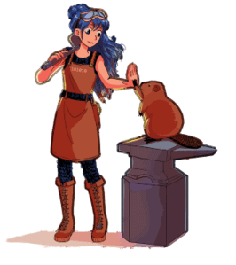

#  Lightpad

## Bienvenue

### Qu'est-ce que Lightpad ?

Lightpad est une --violetfoncé:application-- libre et gratuite qui vous permet de créer des "pads" avec des colonnes et des capsules, à la manière de [Digipad](https://digipad.app).

C'est une version dérivée de [MarkPage](https://markpage.forge.apps.education.fr/). Comme avec ce dernier, l'édition se fait en Markdown.

### Comment ça marche ?

Il suffit de créer un texte sur [Codimd](https://codimd.apps.education.fr), [Framapad](https://framapad.org/abc/fr/) ou [Digipage](https://digipage.app/) puis de copier son URL.

Votre Lightpad sera ensuite accessible à l'adresse

```
https://lightpad.forge.apps.education.fr/#LIEN_DE_VOTRE_FICHIER

```

<label for="urlInput">Entrez l'URL de votre fichier en Markdown :</label>

<input type="url" id="urlInput" placeholder="Votre URL"> <button id="okButton">OK</button>

### Exemple

Vous pouvez partir de [cet exemple](https://codimd.apps.education.fr/YGJdl513QfaBSmH_XCZW4Q?both) sur Codimd et le dupliquer.

Codimd est recommandé plutôt que Framapad car sur Codimd, l'éditeur vous “facilitera la vie”.
Des boutons dédiés permettent de formater correctement le texte. De plus il affiche une coloration syntaxique qui aide à s'y retrouver.


## Structure du pad

### Titre du pad

Pour donner un titre à votre pad, faites-le précéder de #.
Exemple

```
# Mon pad d'ERUN
```

### Colonnes

Les titres de colonnes sont précédés de ##.
Exemple

```
## Bienvenue
```

### Capsules

Les titres de capsules sont précédés de ###.
Exemple
```
### Comment ça marche ?
```

### En résumé

Il faut donc structurer le texte en colonnes et en capsules.
Et on écrit à l'intérieur.
Exemple

```
# Lightpad

## Bienvenue

### Qu'est-ce que Lightpad ?

Lightpad est une application qui...

### Comment ça marche ?

Il suffit de créer un texte sur...
```

## Formatage

### Écrire en gras

Pour écrire **en gras** on encadre avec des **.
```
Texte **en gras**
```

### Écrire en italique

Pour écrire *en italique*, on encadre avec des *.
```
Texte *en italique*
```
On peut ***combiner***.
```
Texte ***en gras italique***
```

### Souligner

Pour ++souligner++ on encadre avec des `++`.
```
Texte ++souligné++
```

### Couleur

Pour --rouge:écrire en couleur-- on encadre avec -- -- en précisant la couleur avant les deux points.

```
Ce texte est --rouge:en rouge--.
```


### Listes

Pour formater une liste, on commence chaque ligne avec un tiret.
```
- pomme
- poire
- abricot
```
donne :
- pomme
- poire
- abricot

### Titres

Pour indiquer un titre à l'intérieur d'une capsule, on le fait précéder de #### ou de ##### (sous-titre)
```
#### Titre
##### Sous-tiree
Contenu
```
donne :
#### Titre
##### Sous-titre
Contenu

## Multimedia

### Images
Pour insérer une image on écrit :
```

```
Par exemple :

```

```

donne :


NB : sur Codimd, vous pouvez faire glisser une image directement depuis votre ordinateur vers l'éditeur de texte.
Et le lien est automatiquement formaté !

### Vidéos
Pour insérer une vidéo, on colle simplement le lien d'intégration (iframe).
Par exemple depuis https://tube-numerique-educatif.apps.education.fr/


```
<iframe title="Présentation de la Journée du Libre éducatif 2024" width="300" height="215" src="https://tube-numerique-educatif.apps.education.fr/videos/embed/85f97f35-d00c-4aa8-ad51-bcc9135ff8a2" frameborder="0" allowfullscreen="" sandbox="allow-same-origin allow-scripts allow-popups allow-forms"></iframe>
```
donne

<iframe title="Présentation de la Journée du Libre éducatif 2024" width="300" height="215" src="https://tube-numerique-educatif.apps.education.fr/videos/embed/85f97f35-d00c-4aa8-ad51-bcc9135ff8a2" frameborder="0" allowfullscreen="" sandbox="allow-same-origin allow-scripts allow-popups allow-forms" loading="lazy"></iframe>


## Autres

### Lien simple

Il suffit de l'écrire tel quel.

Par exemple
https://docs.forge.apps.education.fr/

### Lien hypertexte

On écrit le texte entre [ ]
et le lien entre ( ).

Par exemple :

```
[La doc](https://docs.forge.apps.education.fr/)
```
donne :

[La doc](https://docs.forge.apps.education.fr/)

### Code

Pour afficher du code sans qu'il ne soit interprété, encadrez-le avec des `.

Exemple 


donne

Ceci est du **gras**.

```
Ceci est du **gras**.
```

La deuxième ligne est formatée comme du code car elle est encadrée de signes `.

## Interface

### Navigation

Sur ordinateur, vous pouvez scroller, mais aussi naviguer de capsule en capsule avec le clavier (flèche gauche et flèche droite).

Sur téléphone, vous pouvez swiper d'une colonne à une autre facilement.

### Couleurs

On peut personnaliser l'apparence de Lightpad en utilisant les thèmes disponibles.

On définit le thème dans un en-tête en début de fichier.

```
---
theme: colors
---
```

On peut aussi ajouter des styles CSS en les définissant dans une balise `<style>` (à placer de préférence à la fin de son document).


### Logo

Dans l'en-tête on peut utiliser un logo personnalisé, en le mettant juste avant son titre
```
#  Mon titre
```
:::info
Astuce : sur Codimd il suffit de faire glisser l'image depuis l'ordinateur.
:::

On peut aussi utiliser des [codes emojis](https://eyssette.forge.apps.education.fr/emojis), ou bien copier-coller un emoji !

```
# :de: Meine Webseite
```

```
🇩🇪 Meine Webseite
```


## À propos...

### Crédits

Lightpad est une collaboration d'Arnaud Champollion et de Cédric Eyssette, partagée sous licence libre MIT.

Le code source est sur [la Forge des Communs Numériques](https://forge.apps.education.fr).
Voir [la page du projet](https://forge.apps.education.fr/lightpad/lightpad.forge.apps.education.fr).

Cette application est un dérivé de [Markpage](https://eyssette.forge.apps.education.fr/). Si vous voulez construire un site, Markpage intègre les fonctions de Lightpad mais offre d'autres options à configurer.

### Participer à améliorer Lightpad

Pour rapporter un bug ou soumettre une suggestion, passez par la [page des tickets](https://forge.apps.education.fr/lightpad/lightpad.forge.apps.education.fr/-/issues).

